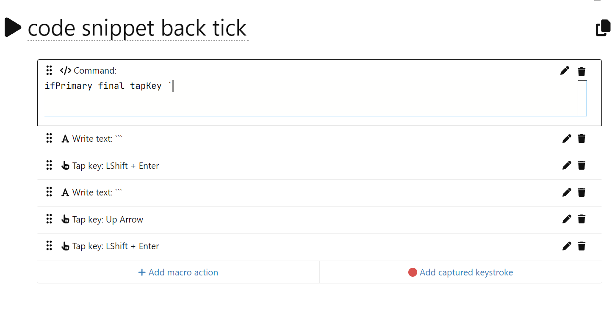

# JSyntax favourite macros
Credit goes to kareltucek and UHK smart macro reference and user guides. This is a selection of macros that I use daily.

## `$onInit`
This macro runs whenever your keyboard is connected to a computer. It is useful for setting up variables and default config values.

You would create this macro in the Agent software manually and designate it as the `$onInit` macro.
```
setVar jigglerActive 0
set autoShiftDelay 0
set oneShotTimeout 5000
```

## `$onKeymapChange <keymap_id>`
This macro runs whenever you change the keymap on your keyboard. In this example, I configure the Mouse layer's speed
```
set mouseKeys.move.initialSpeed 800
set mouseKeys.move.baseSpeed 2300
set mouseKeys.move.initialAcceleration 3000
set mouseKeys.move.deceleratedSpeed 200
set mouseKeys.move.acceleratedSpeed 3500
set mouseKeys.move.axisSkew 1
```

## Mouse jiggler
This macro moves the mouse every few seconds to prevent the computer from going to sleep. It also displays a LED indicator when active.

### 1. Setup `$onInit` variable:
```
setVar jigglerActive 0
```

### 2. Create a macro to start mouse jiggling
Note that this macro is created as part of the Agent's macro wizard into three parts since mouse movements cannot be written as a "command"

_Part 1: Command_

```
setLedTxt 1000 "srt"
setVar stopJiggler 0
if ($jigglerActive) break
setVar jigglerActive 1
loop:
```

_Part 2: Mouse action + Small Delay + Mouse action_


_Part 3: Command_

```
delayUntil 2000
setLedTxt 2000 "jig"

if ($stopJiggler) {
    setVar stopJiggler 0
    setVar jigglerActive 0
    break
}
goTo loop
```

## Remap keys depending on a sequence of modifiers for alt+tab+delete on Windows
For context, in Windows, you can press Alt+Tab and hold Alt to close many windows and applications by pressing Delete.

This macro works so that pressing Alt and then Tab, and continuing to hold Alt, changes the function of the D key to Delete. The D key should revert to its normal function when Alt is released.

I want to preserve the original Alt+D for other applications (meaning I don’t want Alt+D to become Alt+Delete all the time).

Solution:
```
pressKey iLA
ifShortcut noConsume tab set keymapAction.base.d keystroke delete
delayUntilRelease
set keymapAction.base.d keystroke d
releaseKey LA
```

You can extend the solution and bind other keys. In my case, I wanted to temporarily change J K L I to arrow keys when holding Alt. 
Here's the updated scripts:
```
pressKey iLA
ifShortcut noConsume tab {
    // Temporarily rebind keys to new actions
    set keymapAction.base.d keystroke delete
    set keymapAction.base.j keystroke left
    set keymapAction.base.k keystroke down
    set keymapAction.base.l keystroke right
    set keymapAction.base.i keystroke up
}
delayUntilRelease

// Restore keys to their original actions
set keymapAction.base.d keystroke d
set keymapAction.base.j keystroke j
set keymapAction.base.k keystroke k
set keymapAction.base.l keystroke l
set keymapAction.base.i keystroke i
releaseKey LA
```

## Dual function keys
The Agent software for dual function keys in the GUI but is limited to double-tap and hold for layers, not other keys, which requires a smart macro.

### Capslock shift with double tap
This macro makes a key act as a Shift key when held down and as Caps Lock when double-tapped.

For Windows:
```
holdKey iLS
ifDoubletap tapKey capsLock
```

For Mac:
Mac requires a delay to work properly.
```
holdKey iLS
ifNotDoubletap break
pressKey capsLock
delayUntil 400
releaseKey capsLock
```

### Tap once for a key, tap-and-hold for another key
I use this technique mostly for function keys. I can combine a number key with a function key by tapping the number key once and holding it for the function key.

This never interrupted my fast typing, it does not affect shift keys. I can still type numbers and symbols without any issues.
```
ifPrimary final tapKey =
holdKey f12
```

In the following example, I bound R, T, F, G, V, B to F7, F8, F9, F10, F11, F12 respectively so that my left hand can easily reach them.
```
ifPrimary final tapKey g
holdKey f10
```

You can combine tap and tap-and-hold with a macro created in the Agent's macro wizard form since macros are comprised of a sequence of: commands, write text, key action, mouse action, delay. 


### One shot modifier
Tap the shift key once, let go, and then the following key will be capitalized. This is useful for more ergonomic typing since it reduces finger contortions.
Normal shift function is still available by holding the shift key.
```
oneShot holdKey iLS
```

### Tap and release key to hold key, or hold key normally
This macro is great for PC games where your character walks whenever a modifier key is held down. To reduce finger fatigue, you can tap the shift key to hold it down and then tap it again to release it.
Normal shift function is still available by holding the shift key. This can be applied to any other key, like `c` or `ctrl` which is usually held for crouch in games.

```
holdKey iLS
ifNotShift ifNotInterrupted ifNotPlaytime 500 {
    pressKey iLS
    setVar shiftHeld 1
    while $shiftHeld delayUntil 10
}
else {
    setVar shiftHeld 0
}
```

## Record live macros into memory
This macro records a macro into memory (RAM), meaning it will be lost when the keyboard is disconnected or the keyboard is soft reset (via saving new settings in Agent).
This is useful if you want to record macros that change on a daily/hourly basis or want to temporarily store sensitive information.

Bind the following to any key. Hold shift and the key to start and stop recording. When the keyboard is recording, you will see a blinking triangle LED icon.
```
ifShift recordMacro $thisKeyId
ifNotShift playMacro $thisKeyId
```

Bind the following to any key to record a live delay when recording a macro. This is useful for recording macros that require a delay between key presses.
```
recordMacroDelay
```